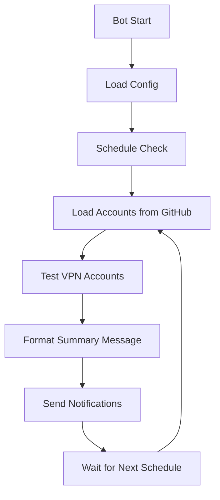

# 🤖 VPN Bot Checker

Automated VPN account monitoring bot yang secara otomatis mengecek status VPN accounts dari GitHub repository dan mengirim laporan melalui Telegram/WhatsApp.

## 📍 Overview

Bot ini dirancang untuk:
- 🔄 **Monitor otomatis** VPN accounts dari repository GitHub
- ⏰ **Scheduled checking** dengan interval yang bisa diatur (dalam menit)
- 📱 **Notifikasi real-time** via Telegram & WhatsApp
- 📊 **Laporan sederhana** jumlah akun hidup/mati
- 🚀 **Menggunakan logic testing** yang sama dengan VortexVPN Manager

## 🏗️ Architecture

```
VortexVPN Manager Repo (https://github.com/Fatttttr/hsjsn)
├── 🌐 Web interface untuk manual testing
├── ⚙️ VPN configuration management
├── 📊 Detailed testing dengan UI
└── 📁 template.json (monitored by bot)

Bot Testing Repo (ini)
├── 🤖 Automated monitoring bot
├── 📱 Telegram/WhatsApp notifications
├── ⏰ Scheduled checking
└── 📊 Simple hidup/mati reports
```

## 🚀 Quick Start

### 1. Clone Repository
```bash
git clone https://github.com/Fatttttr/bot_testing.git
cd bot_testing
git checkout bot_test
```

### 2. Install Dependencies
```bash
pip install -r requirements.txt
```

### 3. Setup Configuration
```bash
cp bot_config.json.example bot_config.json
# Edit bot_config.json dengan credentials Anda
```

### 4. Test Bot
```bash
python test_bot.py
```

### 5. Run Bot
```bash
python bot_vpn_checker.py
```

## ⚙️ Configuration

Edit `bot_config.json`:

```json
{
  "github_token": "ghp_your_github_token",
  "github_owner": "Fatttttr",
  "github_repo": "hsjsn",
  "config_file": "template.json",
  
  "check_interval_minutes": 5,
  "max_concurrent_tests": 5,
  "timeout_seconds": 10,
  
  "send_only_failures": false,
  "send_summary": true,
  
  "telegram_token": "your_telegram_bot_token",
  "telegram_chat_id": "your_telegram_chat_id"
}
```

### GitHub Settings
- **`github_token`**: Personal Access Token dengan akses repository
- **`github_owner`**: Username GitHub (Fatttttr)
- **`github_repo`**: Repository yang dimonitor (hsjsn)
- **`config_file`**: File yang dimonitor (template.json)

### Testing Settings
- **`check_interval_minutes`**: Interval pengecekan (default: 5 menit)
- **`max_concurrent_tests`**: Maksimal test bersamaan (default: 5)
- **`timeout_seconds`**: Timeout per test (default: 10 detik)

### Notification Settings
- **`send_summary`**: Kirim laporan summary (true/false)
- **`telegram_token`**: Bot token dari @BotFather
- **`telegram_chat_id`**: Chat ID tujuan notifikasi

## 📱 Setup Telegram Bot

### 1. Create Bot
1. Chat dengan [@BotFather](https://t.me/BotFather)
2. Gunakan `/newbot` dan ikuti instruksi
3. Simpan **token** yang diberikan

### 2. Get Chat ID
1. Start bot Anda di Telegram
2. Kirim pesan ke bot
3. Akses: `https://api.telegram.org/bot<TOKEN>/getUpdates`
4. Cari `"chat":{"id":CHAT_ID}`

## 🧪 Testing

### Manual Test
```bash
python test_bot.py
```

Test ini akan:
- ✅ Load konfigurasi
- 🔍 Test koneksi GitHub
- 📊 Load dan test VPN accounts
- 📱 Format sample message
- 🚀 Optional: kirim test notification

### Configuration Test
```bash
python -c "from bot_vpn_checker import load_bot_config; print(load_bot_config())"
```

## 🔄 Bot Workflow



### Sample Bot Message
```
🔍 VPN Status Report - 14:30:25

✅ Akun Hidup: 12
❌ Akun Mati: 3
📦 Total: 15

📊 80% akun masih berfungsi

🔄 Cek otomatis setiap 5 menit
```

## 📁 File Structure

```
bot_testing/
├── bot_vpn_checker.py          # Main bot script
├── bot_config.json.example     # Configuration template
├── bot_config.json             # Your configuration
├── requirements.txt            # Python dependencies
├── test_bot.py                 # Manual testing script
├── README.md                   # This documentation
└── core/                       # VPN testing logic
    ├── __init__.py            # Package initialization
    ├── github_client.py       # GitHub API client
    ├── core.py                # VPN testing core
    ├── extractor.py           # Account extraction
    └── converter.py           # Config conversion
```

## 🔧 Advanced Configuration

### Environment Variables
Alternatif konfigurasi via environment variables:

```bash
export GITHUB_TOKEN="ghp_your_token"
export GITHUB_OWNER="Fatttttr"
export GITHUB_REPO="hsjsn"
export CONFIG_FILE="template.json"
export CHECK_INTERVAL_MINUTES="5"
export TELEGRAM_TOKEN="your_bot_token"
export TELEGRAM_CHAT_ID="your_chat_id"
```

### Systemd Service (Linux)
Buat `/etc/systemd/system/vpn-bot.service`:

```ini
[Unit]
Description=VPN Bot Checker
After=network.target

[Service]
Type=simple
User=your_user
WorkingDirectory=/path/to/bot_testing
ExecStart=/usr/bin/python3 bot_vpn_checker.py
Restart=always
RestartSec=10

[Install]
WantedBy=multi-user.target
```

Aktifkan:
```bash
sudo systemctl enable vpn-bot
sudo systemctl start vpn-bot
sudo systemctl status vpn-bot
```

## 🐛 Troubleshooting

### Common Issues

**❌ "Missing required GitHub configuration!"**
- Pastikan `bot_config.json` ada dan terisi lengkap
- Cek GitHub token masih valid

**❌ "No VPN accounts found"**  
- Pastikan file `template.json` ada di repository target
- Cek format JSON file valid
- Pastikan ada VPN accounts di dalam config

**❌ "Failed to send Telegram notification"**
- Cek Telegram token valid
- Pastikan bot sudah di-start di Telegram
- Cek chat ID benar

### Debug Mode
Jalankan dengan logging detail:
```bash
python -c "
import logging
logging.basicConfig(level=logging.DEBUG)
exec(open('bot_vpn_checker.py').read())
"
```

## 🔗 Related Projects

- **[VortexVPN Manager](https://github.com/Fatttttr/hsjsn)**: Web interface untuk manual testing
- **Bot Testing**: Repository ini untuk automated monitoring

## 📝 Development

### Branch Strategy
- **`main`**: Stable releases
- **`bot_test`**: Development branch untuk bot features

### Contributing
1. Fork repository
2. Create feature branch dari `bot_test`
3. Test perubahan dengan `test_bot.py`
4. Submit pull request

## 📄 License

MIT License - Feel free to use and modify.

---

**🤖 Bot akan monitor repository VortexVPN Manager dan kirim laporan hidup/mati otomatis!** 🚀